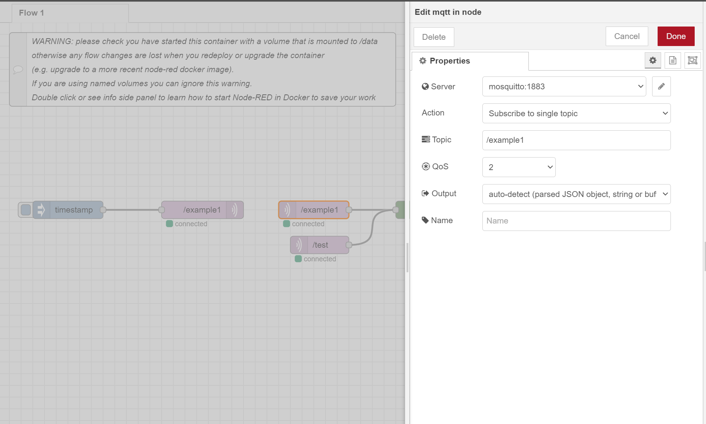
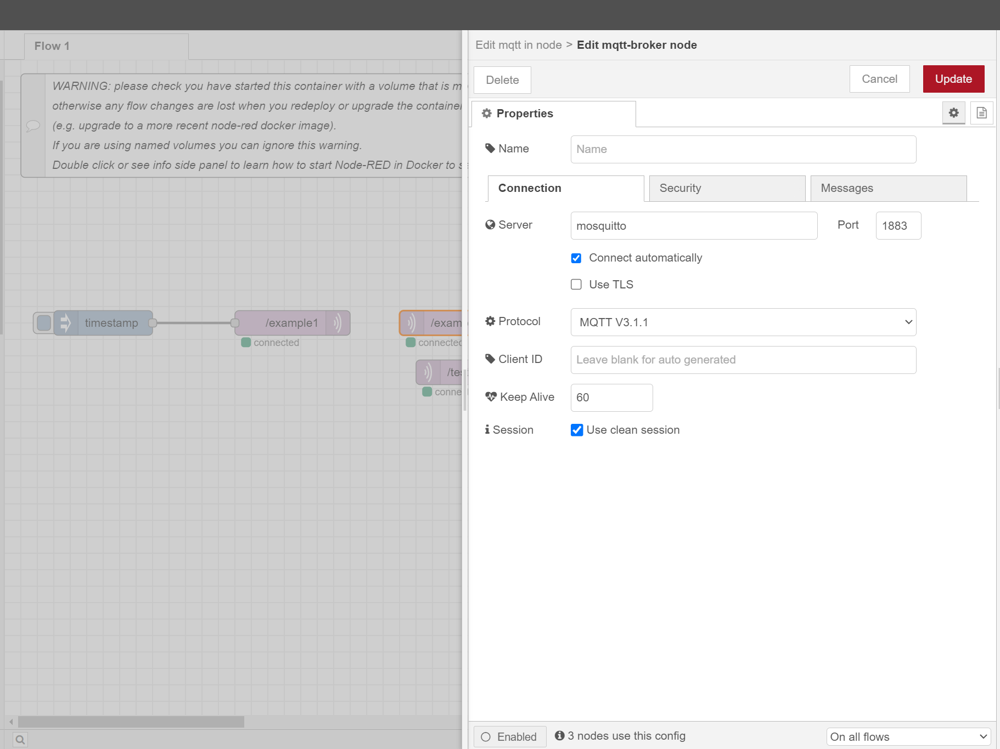

# NodeRedDocker
Docker container for quickly setting up node red

# To run node-red docker container:

## 1. Clone repository:
```sh
git clone https://github.com/aijalam/NodeRedDocker.git
```

## 2. Chage to repository root directory:
```sh
cd ./NodeRedDocker
```

## 3. Run containers
Start containers:
```sh
docker-compose up -d
```

Stop containers:
```sh
docker-compose down
```

Commands for monitoring containers:
```sh
docker-compose ps
```
```sh
docker-compose logs
```
# Access Node Red:
You can access Node Red from host machine using host machines IP address or by using [localhost:1880](localhost:1880).

# Configure MQTT in node-red:
MQTT uses port 1883. In Node Red you can access MQTT broker by using settings in following images. If you want to access it from your host machine use your host machines IP or localhost.


